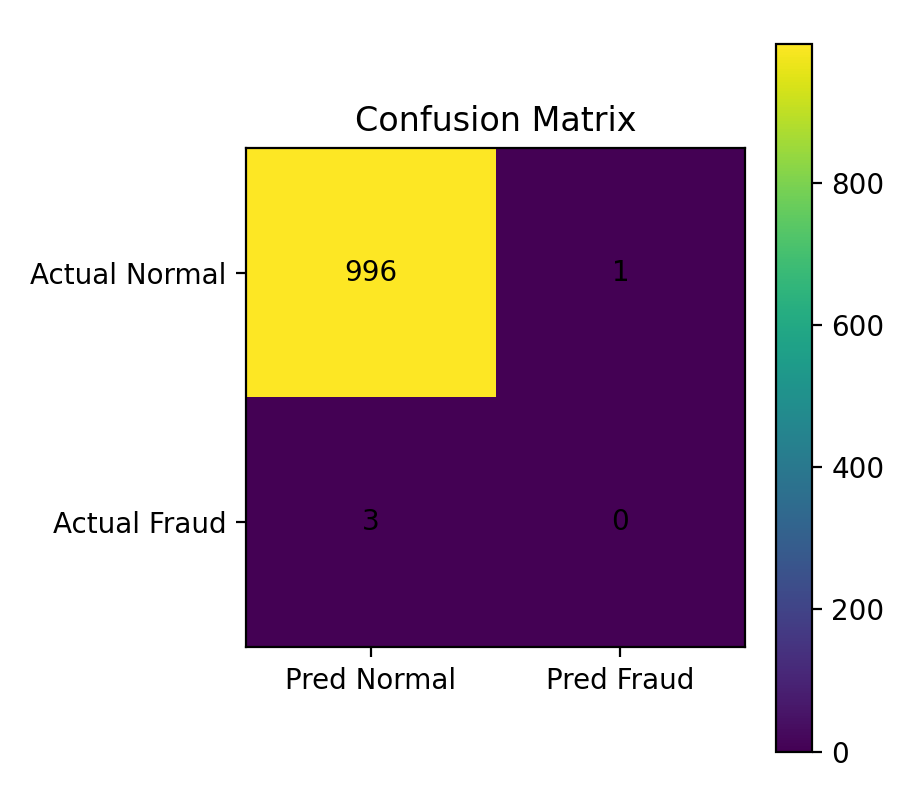

# 🛡️ Data Mining Project — Cryptocurrency Fraud Detection (Naive Bayes)

Kelompok 1 — Universitas Pamulang  
Mata Kuliah: Data Mining  
Dosen: Tri Prasetyo

---

## 📌 Judul

**Prediksi Transaksi Fraud pada Cryptocurrency Menggunakan Algoritma Naive Bayes**

## 👥 Anggota Kelompok

- Achmad Syahril Fauzi (231011450396)
- Abdul Fakhry (231011450644)
- Ahmad Imam (231011450458)

---

## 🧠 Ringkasan Proyek

Proyek ini mendeteksi apakah transaksi kripto **Normal (0)** atau **Fraud (1)** dengan model **Naive Bayes** pada **synthetic dataset** (≈ 5.000 baris).  
Naive Bayes dipilih karena sederhana, cepat, dan cocok untuk klasifikasi biner sebagai **baseline**.

---

## 🗂️ Struktur Repository

.
├── crypto_fraud_basic.py # Script utama (generate data, train NB, evaluasi)
├── requirements.txt # Dependencies minimal
├── Data_Mining_Fraud_Detection.pptx # Slide presentasi
├── outputs_basic/ # Hasil eksekusi (terbuat saat run)
│ ├── fraud_dataset.csv
│ ├── confusion_matrix.csv
│ ├── confusion_matrix.png
│ ├── classification_report.txt
│ └── metrics.txt
└── README.md

## 📊 Deskripsi

Proyek ini bertujuan untuk **mendeteksi transaksi fraud pada cryptocurrency**  
menggunakan algoritma **Naive Bayes** sebagai model klasifikasi biner.

Dataset yang digunakan adalah **synthetic dataset** dengan lebih dari **2000 transaksi**,  
berisi fitur utama:

- `amount`
- `transaction_freq_24h`
- `account_age_days`
- `is_weekend`

Label target: `is_fraud` (0 = Normal, 1 = Fraud).

---

## 💻 Prasyarat

- Python 3.9+ (disarankan 3.10/3.11)
- OS: macOS / Linux / Windows

---

## ⚙️ Cara Menjalankan (Repro dari Nol)

```bash
# 1) Clone
git clone https://github.com/DevLabsss/Data-Mining-Fraud-Detection.git
cd Data-Mining-Fraud-Detection

# 2) (Opsional) Virtual env
python3 -m venv .venv
source .venv/bin/activate   # Windows: .venv\Scripts\activate

# 3) Install dependencies
pip install -r requirements.txt

# 4) Jalankan
python3 crypto_fraud_basic.py
```

## 📈 Hasil Evaluasi

- **Algoritma:** Gaussian Naive Bayes
- **Akurasi:** ~99%
- **Confusion Matrix:** tersimpan di `outputs_basic/confusion_matrix.png`
- **Classification Report:** lihat di `outputs_basic/classification_report.txt`

📊 Contoh Confusion Matrix:  


## 🔍 Analisis & Saran

- Dataset imbalance → fraud jauh lebih sedikit dibanding normal.
- Akurasi tinggi tapi recall fraud rendah.
- Perbaikan:
  - Gunakan **SMOTE** untuk balancing.
  - Bandingkan dengan algoritma lain (Logistic Regression, Random Forest).
  - Tambah fitur lain (rasio amount/balance, jam transaksi, dll).

## 📚 Referensi

- Tan, Pang-Ning, Michael Steinbach, dan Vipin Kumar. _Introduction to Data Mining_.
- Dokumentasi scikit-learn: https://scikit-learn.org/
